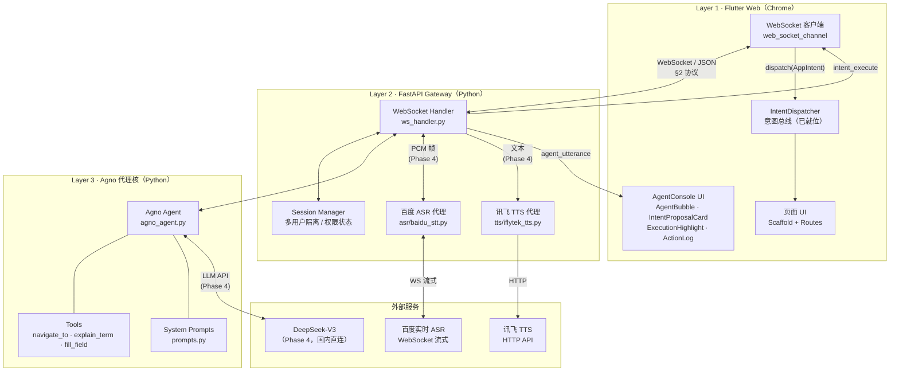
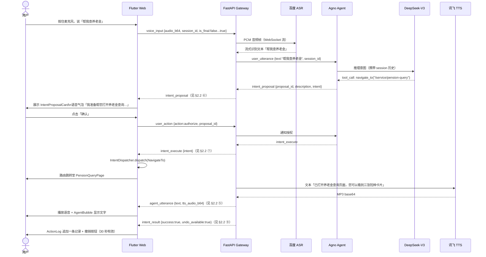

# 智能代理技术架构设计

> 本文件为 Phase 3 及后续阶段的开发蓝图，同时作为中期汇报"开发方向"的叙述基础。  
> 当前状态：Flutter Web 复刻底座（Phase 2）并行进行中；本文件**只规划，不动代码**。

---

## §1 系统架构总览

### 1.1 三层架构

```
┌─────────────────────────────────────────────────────────┐
│  Layer 1 · Flutter Web 前端（Chrome）                   │
│  · AppIntent 意图总线（已就位）                          │
│  · VoiceInputService / FaceAuthService（mock → 真）     │
│  · AgentConsole UI 组件（Phase 3 新增）                  │
└──────────────────────┬──────────────────────────────────┘
                       │ WebSocket（双向长连接）
┌──────────────────────▼──────────────────────────────────┐
│  Layer 2 · 代理中间服务（Phase 3 新建）                  │
│  · Python FastAPI + uvicorn（本地 demo）                 │
│  · 会话管理 / 权限校验 / 速率控制                         │
│  · 消息路由：前端 ↔ Agno 代理核                          │
│  · STT/TTS 适配层（百度 / 讯飞 API 封装）                │
└──────────────────────┬──────────────────────────────────┘
                       │ Python function call
┌──────────────────────▼──────────────────────────────────┐
│  Layer 3 · Agno 代理核                                   │
│  · 意图理解（LLM 推理）                                  │
│  · 任务拆解 + Tool 调用                                  │
│  · 短时记忆（会话上下文）                                │
│  · 受控响应约束（授权前不执行）                          │
└─────────────────────────────────────────────────────────┘
```

### 1.2 为什么需要中间层

| 原因 | 说明 |
|---|---|
| 语言隔离 | Agno 是 Python 库，浏览器无法直接运行；需要 HTTP/WS 桥接 |
| 密钥安全 | LLM API Key（Anthropic / Qwen）、百度 STT、讯飞 TTS 的凭证不能暴露在前端 |
| 会话管理 | 多轮对话的上下文、权限状态、撤销栈放在服务端，前端无需持久化 |
| 速率控制 | 防止前端直接高频调用 LLM，便于后续加入用量统计 |
| STT/TTS 代理 | Web 端捕获音频后发往服务端，服务端调用第三方 API，绕过跨域和 CORS 限制 |

### 1.3 技术选型

| 组件 | 选型 | 理由 |
|---|---|---|
| 中间服务框架 | **FastAPI** | 异步原生、WebSocket 支持好、自动 OpenAPI 文档方便调试 |
| 本地运行 | **uvicorn** | `uvicorn main:app --reload` 一行启动，无需额外部署 |
| 代理框架 | **Agno** | 轻量、多模态原生、推理作为一等公民；符合开题报告选型 |
| Phase 3 LLM | **规则引擎（无 LLM）** | 最小可行 demo 用写死规则，降低调试复杂度 |
| Phase 4 LLM | **Anthropic Claude / Qwen-Max** | Claude 推理能力强；Qwen 国内访问稳定，待用户决策 |

---

## §1.5 Agno 框架深度调研

> 调研日期：2026-04-18；来源：PyPI、GitHub (agno-agi/agno)、docs.agno.com。  
> 部分官方文档页面返回 404（docs 正重组中），已逐条标注「待实装核对」。

### 1.5.1 安装与版本

```bash
pip install agno           # 唯一正确包名（不是 agno-agi，不是旧名 phidata）
```

- **当前最新版**：`2.5.17`（2026-04-15 发布于 PyPI）
- **Python 版本**：3.7–3.12（项目用 3.12）
- **无额外系统依赖**；LLM 供应商 SDK 按需安装（见 §1.5.7）

### 1.5.2 核心概念速览

| 概念 | 类路径 | 作用 |
|---|---|---|
| **Agent** | `agno.agent.Agent` | 对话主体，封装 LLM + 工具 + 会话记忆 |
| **Model** | `agno.models.<provider>.*` | LLM 供应商适配（Claude / Qwen / DeepSeek 等） |
| **Tool** | Python 函数 + `@tool` 装饰器 | 代理可调用的外部能力（自动从 docstring 提取参数 schema） |
| **Memory** | `Agent(add_history_to_context=True)` | 以 `session_id` 为键的短期会话记忆 |

### 1.5.3 最小代码样例（政务助手场景，17 行）

```python
from agno.agent import Agent
from agno.models.openai import OpenAIChat   # DeepSeek 兼容 OpenAI 协议，复用此类
from agno.tools import tool
import os

@tool
def navigate_to(path: str) -> str:
    """导航到指定页面路径。
    Args:
        path (str): 页面路径，如 /service/pension-query
    """
    return f"已导航至 {path}"

agent = Agent(
    name="小浙",
    model=OpenAIChat(
        id="deepseek-chat",
        base_url="https://api.deepseek.com/v1",
        api_key=os.getenv("DEEPSEEK_API_KEY"),
    ),
    tools=[navigate_to],
    instructions="你是浙里办的智能助手小浙，帮助老年用户使用政务服务。回答简洁，用口语化中文。",
    add_history_to_context=True,
    num_history_runs=10,
)

# 同步调用（调试用）
response = agent.run("帮我查养老金", session_id="user_001")

# 流式调用（生产环境）
for event in agent.run("帮我查养老金", stream=True, session_id="user_001"):
    print(event.content, end="", flush=True)

# 异步调用（FastAPI WebSocket handler 专用）
async for event in await agent.arun("帮我查养老金", stream=True, session_id="user_001"):
    await ws.send_json({"type": "agent_utterance", "text": event.content})
```

> **⚠️ 待实装核对**：`agno.models.openai.OpenAIChat` 的具体类名在 2.5.x 中需以 `python -c "import agno.models.openai; help(agno.models.openai)"` 确认；`event.content` 的属性名需按实际 `RunEvent` schema 核对（也可能是 `event.delta` 或 `event.text`）。

### 1.5.4 常用 Agent 构造参数

```python
Agent(
    name="str",                    # 代理名称（日志 / 多代理区分用）
    model=Model(),                 # LLM 实例（见 §1.5.7）
    tools=[...],                   # 工具列表；每个元素是 @tool 装饰的函数
    instructions="str",            # 系统提示词（拼接到每次对话的 system 消息）
    add_history_to_context=True,   # 自动将历史对话注入 context
    num_history_runs=10,           # 最多带入最近 N 轮
    session_id="str",              # 会话隔离键；不同 session_id → 独立历史
    markdown=True,                 # 响应格式化为 Markdown（纯文字场景设 False）
)
```

### 1.5.5 关键运行方法

| 方法 | 同步/异步 | 流式 | 适用场景 |
|---|---|---|---|
| `agent.run(input, stream=False, session_id=None)` | 同步 | 可选 | 调试、单元测试 |
| `agent.arun(input, stream=False, session_id=None)` | 异步 | 可选 | **FastAPI WS handler** |
| `agent.print_response(input, stream=True)` | 同步 | 可选 | 本地 CLI 调试 |
| `agent.get_chat_history(session_id)` | 同步 | — | 获取历史记录（日志用） |

流式返回 `Iterator[RunEvent]`（同步）或 `AsyncIterator[RunEvent]`（异步）；`stream_events=True` 可获取完整生命周期事件（ToolCallStarted / ModelRequestCompleted 等）。

### 1.5.6 四项关键能力确认

| 能力 | 支持 | 说明 |
|---|---|---|
| **流式响应** | ✅ | `run(stream=True)` / `arun(stream=True)` |
| **工具调用（Tool Calling）** | ✅ | `@tool` 装饰器自动生成 JSON schema，LLM 决定何时调用 |
| **多轮对话记忆** | ✅ | `session_id` 隔离；`add_history_to_context=True` 自动注入 |
| **async/await** | ✅（有已知缺陷） | `arun()` 支持；但 **async 工具函数**可能不被正确 await（GitHub issues #2845、#3030）——**Phase 3 所有工具函数一律写同步，规避此 bug** |

### 1.5.7 LLM 选型对比（中文政务场景）

| 供应商 | 推荐模型 | 国内直连 | 中文质量 | 价格（输入 / 输出 per 1M tokens） | 建议用途 |
|---|---|---|---|---|---|
| **深度求索** | **DeepSeek-V3** | ✅ | ★★★★★ | ¥2 / ¥8 | **Phase 4 首选**（性价比最高，中文政务表现优秀） |
| 阿里云 | Qwen-Max（Qwen3） | ✅ | ★★★★ | ¥40 / ¥120 | Phase 4 备选（DeepSeek 不稳定时切换） |
| 智谱 | GLM-4-Flash | ✅ | ★★★ | ¥2 / ¥2 | 低成本调试（对话质量弱于 DeepSeek，不用于 demo） |
| Anthropic | Claude Sonnet 4.6 | ❌ 需代理 | ★★★★★ | $3 / $15 | 仅开发机 prompt 调试（不用于演示环境） |

> **⚠️ 价格随时变动**，实装前请在各供应商控制台确认当前定价。DeepSeek 有按量计费，适合毕设低用量场景。

**决策建议**：Phase 3 不接真 LLM，用硬编码规则；Phase 4 首选 DeepSeek-V3，API Key 申请地址 `platform.deepseek.com`，国内直接注册，无需 VPN。

### 1.5.8 在 FastAPI WebSocket 中集成（推荐模式）

**不使用** AgentOS（AgentOS 是给需要自动路由生成的场景，我们有自定义协议需求）。直接在 `@router.websocket()` 内调用 `agent.arun()`：

```python
# app/ws_handler.py（伪代码，Step 2–3 实现）
from fastapi import APIRouter, WebSocket
from app.agent.agno_agent import agent
from app.schemas import parse_message, AgentUtterance

router = APIRouter()

@router.websocket("/ws/{session_id}")
async def ws_endpoint(ws: WebSocket, session_id: str):
    await ws.accept()
    try:
        while True:
            raw = await ws.receive_json()
            msg = parse_message(raw)

            if msg.type == "user_utterance":
                # 流式获取代理回复，逐块推送给前端
                async for event in await agent.arun(
                    msg.text, stream=True, session_id=session_id
                ):
                    await ws.send_json(
                        AgentUtterance(text=event.content).model_dump()
                    )
            # ... 其他消息类型处理见 §2
    except Exception:
        await ws.close()
```

> **⚠️ 待实装核对**：`event.content` 属性名、流式事件过滤（跳过非文本事件）需按实际 RunEvent 类型处理。

---

## §2 通信协议

### 2.1 前后端通信选型：WebSocket

选择 **WebSocket** 而非 HTTP POST + SSE，理由：

- 代理对话是多轮长会话，WebSocket 避免每轮重新握手
- 代理执行中需要实时推送 `progress_update`（"正在填写信息…"），SSE 方向单向，不够
- 授权/中止是用户随时可发的异步信号，需要双向通道

### 2.2 消息 Schema（完整 JSON 示例）

所有消息均为 JSON 对象，必含字段 `type`、`session_id`、`ts`（ISO 8601 时间戳）。

#### 2.2.1 前端 → 服务端

**① `user_utterance`** — 用户文字输入（直接打字，或 STT 识别后文本）

```json
{
  "type": "user_utterance",
  "session_id": "sess_abc123",
  "ts": "2026-04-18T10:23:01.456Z",
  "text": "帮我查养老金",
  "source": "text"
}
```

| 字段 | 类型 | 必填 | 说明 |
|---|---|---|---|
| `text` | string | ✅ | 用户输入文字（STT 后已转文字） |
| `source` | `"text"` \| `"voice"` | ✅ | 输入来源；`voice` 表示经 STT 转写 |

---

**② `voice_input`** — 原始音频帧（Phase 4 实装 STT 后启用）

```json
{
  "type": "voice_input",
  "session_id": "sess_abc123",
  "ts": "2026-04-18T10:23:01.123Z",
  "audio_b64": "UklGRiQAAABXQVZFZm10...",
  "format": "pcm",
  "sample_rate": 16000,
  "is_final": false
}
```

| 字段 | 类型 | 必填 | 说明 |
|---|---|---|---|
| `audio_b64` | string | ✅ | 音频帧 base64 编码（PCM 16-bit little-endian） |
| `format` | `"pcm"` \| `"wav"` | ✅ | 音频格式；Phase 4 统一用 `pcm` |
| `sample_rate` | int | ✅ | 采样率，固定 16000 |
| `is_final` | bool | ✅ | `true` 表示用户松开麦克风，本次输入结束 |

---

**③ `user_action`** — 用户对 `intent_proposal` 的响应（授权 / 拒绝 / 中止）

```json
{
  "type": "user_action",
  "session_id": "sess_abc123",
  "ts": "2026-04-18T10:23:05.789Z",
  "action": "authorize",
  "proposal_id": "prop_001"
}
```

| 字段 | 类型 | 必填 | 说明 |
|---|---|---|---|
| `action` | `"authorize"` \| `"deny"` \| `"abort"` | ✅ | `authorize`=点确认；`deny`=点取消；`abort`=随时中止当前任务 |
| `proposal_id` | string | 条件必填 | `action` 为 `authorize`/`deny` 时必填 |

---

**④ `session_control`（前端 → 服务端）** — 心跳 / 会话管理

```json
{
  "type": "session_control",
  "session_id": "sess_abc123",
  "ts": "2026-04-18T10:23:00.000Z",
  "action": "heartbeat"
}
```

| `action` 值 | 说明 |
|---|---|
| `heartbeat` | 每 30 秒一次，防止 WS 连接超时 |
| `resume` | 网络断线重连后恢复会话，带 `last_ts` 字段 |

---

#### 2.2.2 服务端 → 前端

**⑤ `agent_utterance`** — 代理回复（文字 + 可选 TTS 音频）

```json
{
  "type": "agent_utterance",
  "session_id": "sess_abc123",
  "ts": "2026-04-18T10:23:02.100Z",
  "text": "好的，我来帮您查一下养老金。",
  "tts_audio_b64": "//NExAA...",
  "is_partial": false
}
```

| 字段 | 类型 | 必填 | 说明 |
|---|---|---|---|
| `text` | string | ✅ | 代理回复文字（用于 AgentBubble 显示） |
| `tts_audio_b64` | string \| null | 可选 | MP3 base64；Phase 3 为 `null`，Phase 4 讯飞 TTS 后填充 |
| `is_partial` | bool | ✅ | 流式输出时 `true` 表示片段，`false` 表示本轮回复结束 |

---

**⑥ `intent_proposal`** — 代理提议操作（预告阶段，等待用户授权）

```json
{
  "type": "intent_proposal",
  "session_id": "sess_abc123",
  "ts": "2026-04-18T10:23:02.500Z",
  "proposal_id": "prop_001",
  "description": "帮您打开养老金查询页面",
  "intent": {
    "action": "NavigateTo",
    "path": "/service/pension-query"
  },
  "requires_auth": true,
  "timeout_sec": 30
}
```

| 字段 | 类型 | 必填 | 说明 |
|---|---|---|---|
| `proposal_id` | string | ✅ | 唯一 ID，用于 `user_action` 回传 |
| `description` | string | ✅ | 面向老年用户的口语化描述（不是技术路径） |
| `intent.action` | string | ✅ | 对应 `AppIntent` 子类名 |
| `intent.path` / `intent.*` | any | 条件 | 动作参数（NavigateTo 需要 `path`，DoLogin 需要 `userName` 等） |
| `requires_auth` | bool | ✅ | 是否需要用户手动确认（L1 引导类可设 `false`） |
| `timeout_sec` | int | ✅ | 倒计时秒数；超时自动视为 `deny` |

---

**⑦ `intent_execute`** — 授权后执行指令（前端收到后调用 IntentDispatcher）

```json
{
  "type": "intent_execute",
  "session_id": "sess_abc123",
  "ts": "2026-04-18T10:23:06.200Z",
  "proposal_id": "prop_001",
  "intent": {
    "action": "NavigateTo",
    "path": "/service/pension-query"
  }
}
```

前端处理逻辑：

```dart
// Flutter 端伪代码
case "intent_execute":
  final intent = AppIntent.fromJson(msg["intent"]);
  IntentDispatcher.dispatch(intent);  // → router.go("/service/pension-query")
```

---

**⑧ `progress_update`** — 执行中实时进度推送

```json
{
  "type": "progress_update",
  "session_id": "sess_abc123",
  "ts": "2026-04-18T10:23:06.300Z",
  "text": "正在打开养老金查询页面…",
  "stage": "executing",
  "done": false
}
```

| `stage` 值 | 说明 |
|---|---|
| `executing` | 操作执行中 |
| `done` | 本次任务全部完成（同时 `done: true`） |
| `error` | 执行出错（附 `error_message` 字段） |

---

**⑨ `intent_result`** — 最终结果（任务完成确认阶段）

```json
{
  "type": "intent_result",
  "session_id": "sess_abc123",
  "ts": "2026-04-18T10:23:06.500Z",
  "proposal_id": "prop_001",
  "success": true,
  "summary": "已打开养老金查询页面，您可以看到三张险种卡片。",
  "undo_available": true,
  "undo_expires_at": "2026-04-18T10:23:36.500Z"
}
```

| 字段 | 说明 |
|---|---|
| `undo_available` | 是否可撤销（GoBack intent 有效期内为 `true`） |
| `undo_expires_at` | 撤销按钮的过期时间（`now + 30s`） |

---

**⑩ `clarification_request`** — 代理意图模糊，请求用户澄清

```json
{
  "type": "clarification_request",
  "session_id": "sess_abc123",
  "ts": "2026-04-18T10:23:02.800Z",
  "text": "我没太明白您的意思，是要查养老金余额，还是查缴费记录？",
  "options": [
    { "label": "查余额", "value": "check_balance" },
    { "label": "查缴费记录", "value": "check_history" }
  ]
}
```

前端收到后，`AgentBubble` 展示文字 + 快捷选项按钮（`options` 非空时）；用户点选后发送 `user_utterance` 带选中 `value`。

---

**⑪ `session_control`（服务端 → 前端）** — 服务端发出的控制指令

```json
{
  "type": "session_control",
  "session_id": "sess_abc123",
  "ts": "2026-04-18T10:23:00.000Z",
  "action": "session_created",
  "payload": { "expires_at": "2026-04-18T11:23:00.000Z" }
}
```

| `action` 值 | 说明 |
|---|---|
| `session_created` | WS 连接成功，返回会话有效期 |
| `heartbeat_ack` | 回应前端心跳 |
| `session_expired` | 会话超时，前端应重连 |
| `rate_limited` | 触发速率限制，带 `retry_after_sec` 字段 |

### 2.3 `intent_proposal` 映射到 `AppIntent`

前端收到 `intent_execute` 后，直接将 `intent` 字段反序列化为 `AppIntent` 子类，交给 `IntentDispatcher.dispatch()`。

```
intent_execute.intent.action = "NavigateTo"
  → NavigateTo(path: intent_execute.intent.path)
  → IntentDispatcher.dispatch(NavigateTo("/service/pension-query"))
  → router.go("/service/pension-query")
```

已有的 `AppIntent` 子类全部可复用：

| `intent.action` | AppIntent 子类 | 用途 |
|---|---|---|
| `NavigateTo` | `NavigateTo(path)` | 跳转页面 |
| `GoBack` | `GoBack()` | 返回上一页 |
| `SwitchMode` | `SwitchMode()` | 标准版 ↔ 长辈版 |
| `DoLogin` | `DoLogin(userName)` | 代填登录（Phase 4） |
| `DoLogout` | `DoLogout()` | 登出 |
| `FillField`（待扩展）| — | 填写表单字段（Phase 4） |
| `SubmitForm`（待扩展）| — | 提交表单（需明确授权） |

> **待用户决策**：`FillField` / `SubmitForm` 是否加入 AppIntent，或通过单独的 DOM 操作通道实现（Web 上无 Android AccessibilityService，需替代方案，见 §4.4）。

---

## §3 受控响应型流程详设

### 3.1 三阶段交互模型

依据开题报告"预告-执行-确认"三阶段模型：

```
用户发出意图（语音/文字）
        ↓
[预告阶段] ──────────────────────────────────────────
  · 代理解析意图，生成 intent_proposal
  · 语音播报："我准备帮您打开养老金查询，请确认"
  · UI 展示 IntentProposalCard（操作描述 + 授权/拒绝按钮）
  · 等待用户授权（超时 30 秒自动取消）
        ↓ 用户点"确认"
[执行阶段] ──────────────────────────────────────────
  · 服务端发 intent_execute → 前端 IntentDispatcher.dispatch()
  · 执行时语音播报："正在打开…"
  · ExecutionHighlight 高亮当前被操作的 UI 元素
  · 实时 progress_update 推送到 AgentSpeechBubble
        ↓ 执行完成
[确认阶段] ──────────────────────────────────────────
  · 语音播报操作结果："已打开养老金查询页面"
  · ActionLog 追加一条可追溯记录
  · 提供撤销按钮（GoBack intent，保留 30 秒）
```

用户在任何阶段点"停止"→ 发送 `intent_abort` → 服务端停止任务 → 前端恢复常态。

### 3.2 权限分级模型（对应开题报告三级）

| 级别 | 名称 | 代理能做什么 | 用户需要确认什么 |
|---|---|---|---|
| L1 | 引导 | 语音+视觉指引（高亮、指向），不触发任何操作 | 无需确认，实时引导 |
| L2 | 代填不提交 | 填写表单字段（FillField），但不点击提交按钮 | 提交前逐项确认内容 |
| L3 | 全权代办 | 完整执行整个任务流（包括提交） | 任务开始前一次授权 |

Phase 3 只实现 L1（导航 + 引导）。L2/L3 留 Phase 4。

### 3.3 新增 UI 组件清单（不写代码，仅描述需求）

#### `AgentSpeechBubble`
- **位置**：悬浮在页面底部，高于 PersistentBanner，低于 FAB
- **行为**：显示代理最近一条语音文字；TTS 播放时有波形动画；可点击展开完整对话历史
- **与 PersistentBanner 关系**：AgentConsole 激活时，PersistentBanner 自动隐藏（两者共用底部区域，互斥显示）

#### `IntentProposalCard`
- **位置**：模态浮层（InAppOverlay），出现在屏幕中部偏下
- **行为**：展示代理拟执行的操作描述（中文自然语言）+ 路由/意图摘要；两个大按钮（✅ 确认授权 / ❌ 取消）；30 秒倒计时进度条，超时自动取消
- **适老化**：按钮高度 ≥ 56dp，字号 ≥ 18sp，操作描述以老年人能理解的口语化方式展示

#### `ExecutionHighlight`
- **位置**：叠加在被操作的目标 Widget 上方（Stack 层）
- **行为**：橙色脉冲边框 + 箭头指向；代理"正在操作"时显示，操作完成后淡出
- **实现方式**：通过 `GlobalKey` 获取目标 Widget 的位置，Overlay 绘制高亮层

#### `ActionLog`
- **位置**：可从 AgentSpeechBubble 展开
- **行为**：时间线列表，每次操作一条（时间 + 操作描述 + 结果状态）；提供"撤销此操作"按钮（有效期内）

---

## §4 STT / TTS 集成

### 4.1 百度实时语音识别（STT）

**推荐方式：WebSocket 长连接**（百度提供实时流式 ASR WebSocket API）

```
Web 麦克风 → MediaRecorder (PCM/16kHz) → 服务端 WebSocket
  → 百度 ASR WebSocket → 流式返回识别文本 → Agno 意图解析
```

- Web 端用 `MediaRecorder` API 捕获麦克风音频，封包后通过 WebSocket 发往服务端
- 服务端做百度 ASR 的 WebSocket 代理（处理签名鉴权，屏蔽凭证）
- 方言配置：百度 ASR `dev_pid` 参数切换（普通话 1537 / 粤语 1637 / 四川话 1736）
- **`VoiceInputService` 改造**：当前 `listen()` 返回 `Future<String>`；接真 API 后替换为向服务端发 `voice_input` 消息，接收服务端流式返回的识别文本

### 4.2 科大讯飞 TTS

**推荐方式：HTTP API（非流式，返回 MP3）**，Phase 4 视延迟需求升级为 WebSocket 流式

```
服务端构造 TTS 请求（文本 + 音色参数）→ 讯飞 API → 返回 MP3
  → 服务端将 MP3 base64 或临时 URL 发给前端 → Web Audio API 播放
```

- 老年友好音色：讯飞 `vcn=xiaoyan` 或定制老年温和音色
- 前端用 `AudioContext` 或 `<audio>` 标签播放

### 4.3 流式 vs 批处理

| 场景 | 策略 | 原因 |
|---|---|---|
| STT（方言识别） | **流式** | 老年用户语速慢、停顿多；实时反馈减少焦虑感 |
| TTS（代理播报） | **批处理**（Phase 3）→ 流式（Phase 4） | Phase 3 单次回复短，批处理延迟可接受；Phase 4 长回复再改流式 |

### 4.4 Web 端 UI 自动化（替代 Android AccessibilityService）

**问题**：开题报告引用的 Android AccessibilityService（实时提取屏幕 XML 节点树）在 Flutter Web 上不适用。

**替代方案（三选一，待用户决策）**：

| 方案 | 原理 | 优点 | 缺点 |
|---|---|---|---|
| A · 语义树（推荐） | Flutter `Semantics` Widget 已在扩展点预留；Web 端 `flutter_web_accessibility` 暴露 ARIA 树 | 原生 Flutter 支持，无需额外工具 | 需为每个可操作元素挂 `Semantics` 标签（Phase 2 已预留扩展点）|
| B · GlobalKey 坐标 | 每个代理可操作的 Widget 注册 GlobalKey；执行时获取 RenderBox 坐标 | 精确定位，适合 ExecutionHighlight | 需手动维护 Key 注册表 |
| C · IntentDispatcher 直接驱动 | 代理只发 AppIntent（NavigateTo/FillField 等），不需要感知 UI 坐标 | 最简单，Phase 3 够用 | 无法做 ExecutionHighlight 精确高亮 |

**Phase 3 建议**：先用方案 C（IntentDispatcher 直接驱动），跑通场景流程。Phase 4 按需叠加方案 A（Semantics）实现 ExecutionHighlight。

---

## §5 三个首批场景映射

### 场景 1：查养老金

| 环节 | 内容 |
|---|---|
| 用户话术 | "帮我查养老金" / "我养老金在哪看" |
| STT 输出 | "帮我查养老金" |
| Agno 解析 intent | `NavigateTo("/service/pension-query")`，置信度高，直接预告 |
| 预告阶段 | 语音："我准备帮您打开养老金查询页面，点确认就去" + IntentProposalCard |
| 用户确认 | 点"确认授权" |
| 执行阶段 | `IntentDispatcher.dispatch(NavigateTo("/service/pension-query"))` → 路由跳转 |
| 确认阶段 | 语音："已打开，您可以看到三张险种卡片" |
| 预期交互时长 | STT 2s + 预告展示 3s + 用户确认 3s + 执行 1s = **≈ 9 秒** |

### 场景 2：交医保

| 环节 | 内容 |
|---|---|
| 用户话术 | "我要交医保" / "帮我缴费" |
| STT 输出 | "我要交医保" |
| Agno 解析 intent | 歧义：可能是 `NavigateTo("/service/social-insurance")` 或搜索"医保缴费"；触发意图澄清 |
| 意图澄清 | 语音："您是要直接打开社保缴费服务，还是先搜索一下？" |
| 用户回答 | "直接打开" |
| 预告 + 执行 | `NavigateTo("/service/social-insurance")` → SocialInsurancePage |
| 确认阶段 | 语音："已打开社保费缴纳，您可以点「我为自己缴」开始缴费" |
| 预期交互时长 | **≈ 18 秒**（含一轮澄清） |

### 场景 3：看不懂术语

| 环节 | 内容 |
|---|---|
| 用户话术 | "这个「灵活就业」是什么意思" / "「城乡居民」我不懂" |
| STT 输出 | "灵活就业是什么意思" |
| Agno 解析 intent | `ExplainTerm("灵活就业")`（新 intent，不触发导航，直接回答） |
| 代理回复 | 语音："灵活就业人员就是没有单位的，自己给自己交社保的人，比如开店的、跑外卖的" |
| UI | AgentSpeechBubble 显示文字，TTS 朗读；**不弹 IntentProposalCard**（术语解释不需要授权） |
| 确认阶段 | 语音："听清楚了吗？需要我再说一遍吗？" |
| 预期交互时长 | STT 2s + LLM 解释 1s + TTS 5s = **≈ 8 秒** |

---

## §6 受控响应 UI 组件清单

### 组件位置总览

```
┌─────────────────────────────────────────────────┐
│ Scaffold                                        │
│  AppBar                                         │
│  body: Stack                                    │
│  ├─ 页面主体内容                                 │
│  ├─ ExecutionHighlight（Overlay，操作时出现）    │
│  └─ Align(bottomCenter)                         │
│      ├─ AgentSpeechBubble（代理激活时）          │
│      └─ PersistentBanner（未登录 + 代理未激活）  │
│  FAB: mic（已有）                               │
│  BottomAppBar（已有）                           │
│                                                 │
│  全局 Overlay:                                  │
│  └─ IntentProposalCard（需授权时弹出）           │
└─────────────────────────────────────────────────┘
```

### 各组件行为规范

| 组件 | 触发时机 | 消失时机 | 与 PersistentBanner 关系 |
|---|---|---|---|
| `AgentSpeechBubble` | 代理会话开始（麦克风激活） | 用户主动关闭 / 会话超时 | **互斥**：代理激活时 Banner 隐藏 |
| `IntentProposalCard` | 服务端推送 `intent_proposal` | 用户授权/拒绝 / 30s 超时 | 覆盖页面，Banner 被遮盖 |
| `ExecutionHighlight` | 服务端推送 `intent_execute` | `progress_update` type=done 后淡出 | 与 Banner 不冲突（位置不同）|
| `ActionLog` | AgentSpeechBubble 展开时 | 折叠时 | — |

### 适老化设计要求

- 所有代理响应文本：字号 ≥ 18sp，行高 ≥ 1.6，对比度 ≥ 4.5:1
- IntentProposalCard 授权按钮：高度 ≥ 56dp，文字"确认，帮我做"（非"OK"或"确定"）
- TTS 语速：0.85× 正常语速（讯飞 `speed` 参数）
- AgentSpeechBubble 动画：淡入淡出，无闪烁，持续时间 ≥ 400ms

---

## §7 分阶段实施路线（细化版）

> §9 定义了后端 Step 1–7 的逐步开发路径（每步有明确可验收产出）。本节将后端 Steps 与前端工作对齐到阶段表。

### Phase 3：最小可行代理（Phase 2 完工后启动）

**目标**：文字输入"帮我查养老金" → 服务端返回 `intent_proposal` → 点确认 → 路由跳转 PensionQueryPage → 气泡显示"已打开"。**不接真 LLM，不接语音。**

#### 后端（对应 §9 Step 1–3）

| Step | 工期 | 任务 | 可验收产出 |
|---|---|---|---|
| **1** | 半天 | FastAPI 骨架 + `/health` | `curl localhost:8000/health` → `{"status":"ok"}` |
| **2** | 半天 | WebSocket endpoint + `schemas.py` + echo | WS 发 `user_utterance` → 收 echo 回显 |
| **3** | 1 天 | Agno 最小 Agent（硬编码规则）+ `NavigateTo` / `ExplainTerm` 工具 | 发"帮我查养老金" → 返回 `intent_proposal`（action=NavigateTo） |

#### 前端（与后端 Step 2–3 并行）

| 任务 | 工期 | 说明 |
|---|---|---|
| Flutter `web_socket_channel` 接入 + `WsService` 封装 | 半天 | 与后端 Step 2 联调 |
| `AgentSpeechBubble` 基础版（文字气泡，无 TTS） | 半天 | |
| `IntentProposalCard` 基础版（两按钮，无倒计时） | 半天 | |
| `IntentDispatcher` 接收 `intent_execute` → dispatch | XS | 已有 `AppIntent` 体系，只需解析 JSON |
| 场景 1 端到端联调 + 冒烟测试 | 半天 | |

**Phase 3 合计**：后端 ~2 天 + 前端 ~2 天 = **约 4 天**（可并行，时间线 ~2 天）

---

### Phase 4：接真 LLM + 语音

**目标**：3 个核心场景全部跑通，接入 DeepSeek-V3 + 百度 STT + 讯飞 TTS。

#### 后端（对应 §9 Step 4–7）

| Step | 工期 | 任务 | 可验收产出 |
|---|---|---|---|
| **4** | 1 天 | 接 DeepSeek-V3（OpenAI 兼容） + system prompt 写死 5 场景 | 发"帮我查养老金" → LLM 理解，不依赖硬编码规则 |
| **5** | 1 天 | 接百度 STT（WebSocket 流式） | 发 `voice_input` 音频帧 → 服务端流式返回识别文本 |
| **6** | 1 天 | 接讯飞 TTS（HTTP 批处理） | 服务端返回 `tts_audio_b64`；前端 `<audio>` 播放 |
| **7** | 半天 | CORS + `.env.example` + README 启动文档 | Flutter Web（5000 端口）↔ 后端（8000 端口）无 CORS 报错 |

#### 前端（与后端 Step 4–6 并行）

| 任务 | 工期 | 说明 |
|---|---|---|
| `VoiceInputService` 接真 STT（发 `voice_input` 帧） | 半天 | |
| Web Audio API 播放 TTS（`tts_audio_b64` → `AudioContext`） | 半天 | |
| 场景 2（交医保 + 意图澄清）+ 场景 3（术语解释）联调 | 1 天 | |
| `IntentProposalCard` 补完：30 秒倒计时 + 撤销按钮 | 半天 | |
| `ExecutionHighlight`（GlobalKey 方案 C：IntentDispatcher 直驱） | 半天 | |

**Phase 4 合计**：后端 ~3.5 天 + 前端 ~3 天 = **约 7 天**（可并行，时间线 ~4 天）

---

### Phase 5：完善 + 用户测试

**目标**：L2 权限（代填不提交）、ActionLog UI、5–8 位老年用户可用性测试。

| 任务 | 工期 |
|---|---|
| `FillField` intent 实现（L2 权限，填不提交） | M（2 天） |
| `ActionLog` UI 完整版 + 撤销机制 | S（1 天） |
| `AgentSpeechBubble` 波形动效 | S（0.5 天） |
| Semantics 语义标签补全（配合方案 A UI 自动化） | M（2 天） |
| 5–8 位老年用户可用性测试 + 分析报告 | L（3 天） |
| 测试后迭代修复 | M（2 天） |
| **阶段合计** | **约 10–15 天** |

---

### 实施路线总览

```
Phase 2（当前）  → Phase 3（最小代理）  → Phase 4（LLM+语音）  → Phase 5（测试+完善）
复刻 + 贴皮        规则引擎 + 1 场景      DeepSeek + 3 场景      用户测试 + L2 权限
~2 周              ~2 天（并行）           ~4 天（并行）           ~2–3 周
```

**关键路径**：后端 Step 1→2→3 是 Phase 3 的阻塞项；前端 AgentConsole 组件可以在 Step 2 echo 可用后立即联调，无需等待 Step 3 完成。

---

## §8 架构图

### 8.1 三层系统架构（总览）



### 8.2 单次请求消息流（语音输入 → UI 响应，Phase 4 完整链路）



> **Phase 3 简化链路**：去掉 STT（直接文字输入）、去掉 TTS（只显示 AgentBubble 文字）、去掉 LLM（硬编码规则）。链路从 `user_utterance → Agent（规则） → intent_proposal → user_action → intent_execute → 路由跳转` 共 6 步。

---

## §9 后端项目结构与开发路径

### 9.1 目录结构

后端代码放入仓库根目录下的 `backend/` 文件夹（与 `lib/`、`docs/` 同级），由 **backend 角色负责创建**。

```
backend/
├── app/
│   ├── main.py              # FastAPI 入口；挂载 ws_router，配置 CORS，/health endpoint
│   ├── ws_handler.py        # WebSocket 路由 /ws/{session_id}；消息分发主逻辑
│   ├── schemas.py           # Pydantic v2 消息 schema（与 §2.2 协议一一对应）
│   ├── agent/
│   │   ├── agno_agent.py    # Agno Agent 实例定义；单例或 per-session 工厂
│   │   ├── tools.py         # @tool 函数：navigate_to / explain_term / fill_field
│   │   └── prompts.py       # 系统提示词 + 5 个典型场景的 few-shot 示例
│   ├── asr/
│   │   └── baidu_stt.py     # 百度实时 ASR WebSocket 包装（Step 5 实现）
│   └── tts/
│       └── iflytek_tts.py   # 讯飞 TTS HTTP 包装（Step 6 实现）
├── tests/
│   ├── test_ws.py           # WebSocket endpoint 集成测试（用 httpx AsyncClient）
│   └── test_agent.py        # Agno Agent 单元测试（mock LLM 响应）
├── pyproject.toml           # 依赖管理（推荐 Poetry；备选 pip + requirements.txt）
├── .env.example             # API Key 模板（不提交真实 Key）
└── README.md                # 启动方式 + 环境变量说明
```

### 9.2 关键依赖

```toml
# pyproject.toml（Poetry 格式）
[tool.poetry.dependencies]
python = "^3.12"
fastapi = "^0.115"
uvicorn = { version = "^0.30", extras = ["standard"] }
websockets = "^13.0"
agno = "^2.5"
python-dotenv = "^1.0"
pydantic = "^2.0"
httpx = "^0.27"          # 讯飞 TTS HTTP 请求 + 测试用
openai = "^1.50"         # DeepSeek OpenAI-compatible API（agno 内部依赖或直接用）
```

### 9.3 分步开发路径（backend 照此顺序推进）

| Step | 工期 | 任务 | 可验收产出 |
|---|---|---|---|
| **Step 1** | 半天 | Python 3.12 venv + FastAPI + uvicorn 骨架 | `GET /health` → `{"status":"ok","version":"0.1.0"}`；`uvicorn app.main:app --reload` 正常启动，无报错 |
| **Step 2** | 半天 | WebSocket endpoint `/ws/{session_id}` + `schemas.py` + echo 回显 | 浏览器（或 `wscat`）连接 `ws://localhost:8000/ws/test`，发 `{"type":"user_utterance","session_id":"test","ts":"...","text":"ping","source":"text"}` → 收到完整 echo 回显 |
| **Step 3** | 1 天 | Agno 最小 Agent（**硬编码规则，不接 LLM**）+ `navigate_to` / `explain_term` 两个工具 | 发 `user_utterance {text:"帮我查养老金"}` → 服务端回 `intent_proposal {action:NavigateTo, path:/service/pension-query}`；发"灵活就业是什么意思" → 回 `agent_utterance {text:"...解释..."}`（硬编码文本） |
| **Step 4** | 1 天 | 接真 LLM（DeepSeek-V3，OpenAI-compatible）+ `prompts.py` 写入 5 个场景 few-shot | 同 Step 3 验收条件，但移除硬编码分支，完全由 LLM 理解意图；"帮我查养老金" → LLM 调用 `navigate_to` tool → `intent_proposal` |
| **Step 5** | 1 天 | 接百度 ASR（WebSocket 流式） | 发连续 `voice_input` 音频帧（可用预录 PCM 文件模拟）→ 服务端流式返回 `agent_utterance {text:"帮我查养老金", is_partial:true/false}` |
| **Step 6** | 1 天 | 接讯飞 TTS（HTTP 批处理） | 服务端 `agent_utterance` 中包含非空 `tts_audio_b64`（MP3 base64）；前端 `<audio>` 可正常播放 |
| **Step 7** | 半天 | CORS 配置 + `.env.example` 模板 + `README.md` 启动文档 | Flutter Web（`localhost:5000`）WebSocket 连接后端（`localhost:8000`）无 CORS 报错；`README.md` 中 `uvicorn` 启动命令可复现环境 |

**Step 总工期**：约 **6 天**（Step 1–7，不含前端 AgentConsole 组件）。

### 9.4 .env.example 模板

```bash
# LLM（Phase 4 首选 DeepSeek-V3，platform.deepseek.com 申请）
DEEPSEEK_API_KEY=sk-xxxxxxxxxxxxxxxxxxxxxxxxxxxxxxxx

# 百度实时语音识别 ASR（Step 5，console.bce.baidu.com 申请）
BAIDU_ASR_APP_ID=12345678
BAIDU_ASR_API_KEY=xxxxxxxxxxxxxxxxxxxxxxxxxxxxxxxx
BAIDU_ASR_SECRET_KEY=xxxxxxxxxxxxxxxxxxxxxxxxxxxxxxxx

# 讯飞 TTS（Step 6，console.xfyun.cn 申请）
IFLYTEK_APP_ID=xxxxxxxx
IFLYTEK_API_KEY=xxxxxxxxxxxxxxxxxxxxxxxxxxxxxxxx
IFLYTEK_API_SECRET=xxxxxxxxxxxxxxxxxxxxxxxxxxxxxxxx

# 服务配置
CORS_ORIGINS=http://localhost:5000,http://localhost:3000
SESSION_TIMEOUT_SECONDS=3600
```

### 9.5 README 启动命令（摘要）

```bash
cd backend
python3.12 -m venv .venv && source .venv/bin/activate
pip install poetry && poetry install
cp .env.example .env          # 填入真实 API Key（Step 4–6 才需要）
uvicorn app.main:app --reload --port 8000
# Swagger UI：http://localhost:8000/docs
# WebSocket 测试：wscat -c ws://localhost:8000/ws/test_session
```

---

## 附录：待用户决策项

以下问题影响实施路径，需用户在 Phase 3 开始前确认：

1. **LLM 选型**：Anthropic Claude API（需科学上网）还是 Qwen-Max（阿里云，国内直连）？
2. **`FillField` intent 实现方式**：方案 A（Semantics + ARIA）/ B（GlobalKey）/ C（IntentDispatcher 直驱），Phase 4 用哪个？
3. **代理人设**：是否需要给代理起名字、设定声音形象（参考开题报告 Mediguide 的"白大褂女性形象增强可信度"设计）？
4. **方言配置**：测试用户使用哪种方言？优先支持普通话还是杭州话/吴语？
5. **Session 持久化**：Phase 3 内存 session 即可；Phase 4 是否需要写入磁盘（用于论文用户研究数据收集）？
