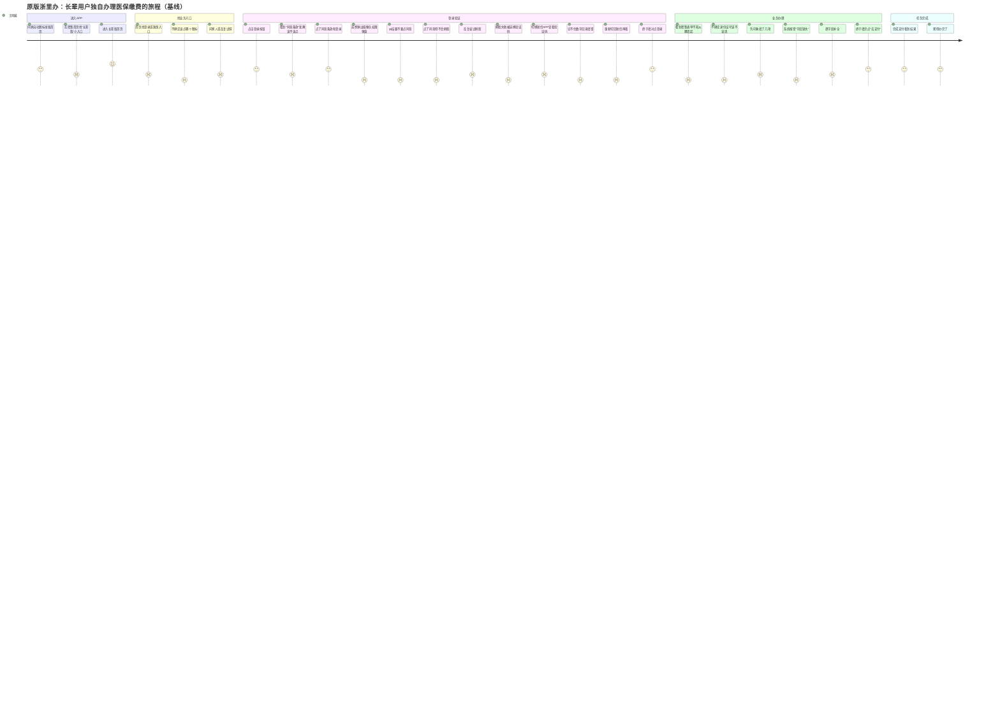
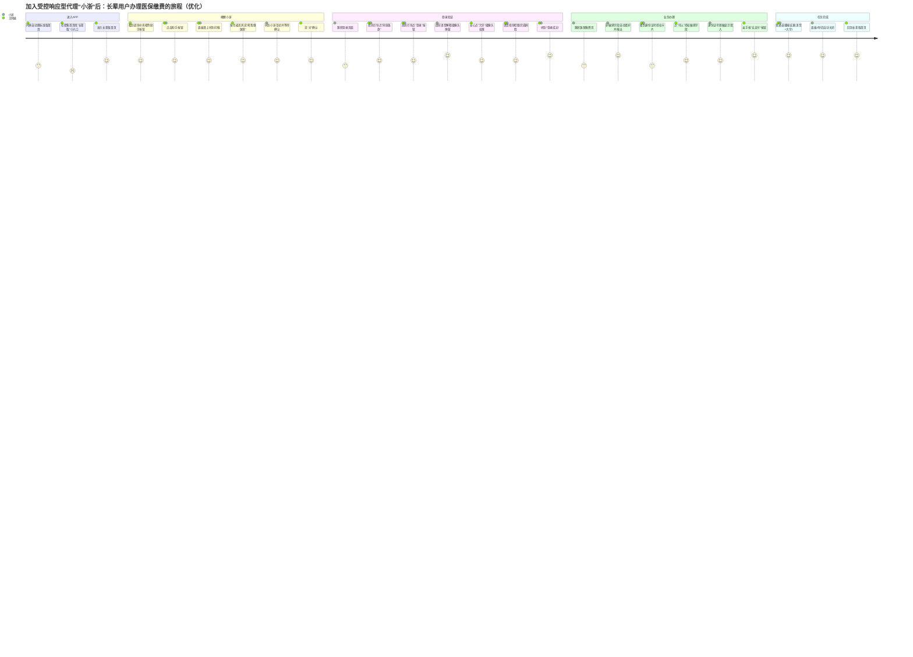
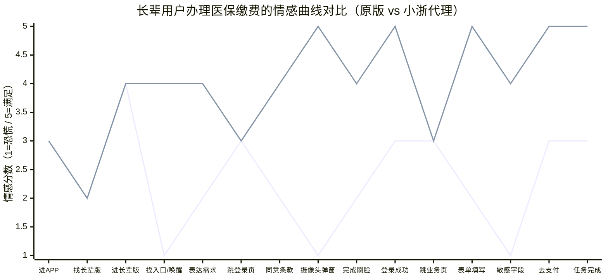
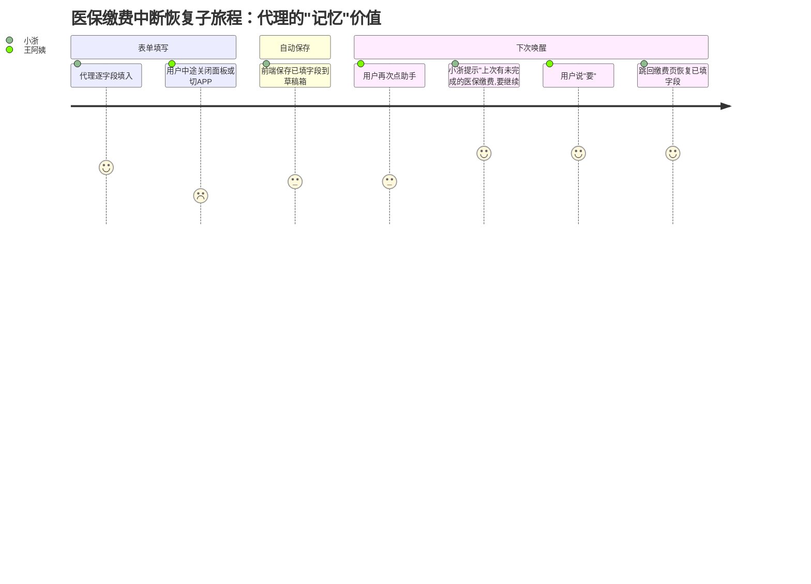

# 用户旅程图：长辈用户办理业务全流程（对比版）

> **版本**：v1.1（2026-05-15）
> **数据来源**：`docs/USER_JOURNEY.md` v1.0、`docs/AGENT_SPEC.md`、开题报告
> **代表路径**：进入 APP → 登录 → 业务办理 → 任务完成
> **对比维度**：原版浙里办（无代理） vs 受控响应型代理"小浙"介入后
> **情感分数**：1（恐慌/挫败）— 3（中性）— 5（满足/惊喜）

---

## 一、为什么要做对比

毕设核心创新点是"**受控响应型智能代理小浙**"。这张旅程图的目的不是描述功能流程，而是回答论文要论证的命题：

> 在长辈用户办理政务业务的同一场景下，**引入受控响应型代理是否真正降低了认知负担与情感挫败、且没有牺牲掌控感**？

因此采用**双旅程对比**：相同的任务终点（登录成功、业务办成），相同的用户角色（68 岁王阿姨），分别走一遍"原版浙里办"和"加了小浙代理"的路径，对照每一步的情感分数。

---

## 二、原版浙里办（无代理）—— 基线旅程

**用户故事**：王阿姨独自打开浙里办，想缴医保。没有任何引导，只能靠自己摸索。

### 基线旅程的情感低点（论文重点关注）

| 低点编号 | 阶段 | 情感分 | 长辈用户的真实困境 |
|---|---|---|---|
| L1 | 找业务入口 | 1 | 长辈版首页图标多、含义不明，长辈分不清"医保"和"医保缴费"在哪 |
| L2 | 摄像头弹窗 | 1 | 系统级弹窗对长辈极度陌生，"不知道点同意会发生什么坏事" |
| L3 | 不会刷脸 | 1 | 没有动作指导，眨眼/正脸/距离都不知道怎么调 |
| L4 | 切短信看验证码 | 1 | APP 间切换对长辈是高难度操作，数字记不住反复切 |
| L5 | 表单不敢填 | 1 | 身份证号、社保号等敏感字段，长辈普遍存在"乱填会出事"的焦虑 |
| L6 | 系统报错 | 1 | 错误提示用术语（"字段必填"），长辈看不懂 |

---

## 三、有小浙代理介入 —— 优化旅程

**同一用户故事**：王阿姨打开浙里办，唤醒小浙后说"帮我缴医保"。

### 优化旅程的设计化解（与上表低点一一对应）

| 对应低点 | 小浙的化解机制 | 设计原则 |
|---|---|---|
| L1 找入口 | 一句"帮我缴医保"直接跳转，无需自己找 | **意图驱动导航** —— 用语言代替图标识别 |
| L2 摄像头弹窗 | **提前**语音解释"马上会弹出摄像头请求" | **预告而非追述** —— 在系统弹窗之前主动告知 |
| L3 不会刷脸 | 语音指导"请看着摄像头，慢慢眨眨眼" | **动作级引导** —— 不只说"刷脸"而说"眨眼" |
| L4 切短信 | 授权卡片询问"小浙想帮您读验证码并填上去" | **代读代填 + 一事一授权** —— 受控行为而非自动接管 |
| L5 不敢填表 | 敏感字段单独授权卡片 + 脱敏显示 | **透明授权** —— 明确说出"身份证号"而非模糊"个人信息" |
| L6 系统报错 | 代填字段格式正确，无报错；如出错由代理重试 | **错误隔离** —— 长辈看不到技术性报错 |

---

## 四、情感曲线对比（一张图两条线）

> 把两条旅程的情感分数对齐到 **15 个任务级共同节点**，绘制双折线图。
> X 轴是业务任务进展（不是步骤数，因为原版 26 步 / 小浙版 25 步对不上），Y 轴是情感分。

**两条线含义**（Mermaid `xychart-beta` 暂不支持图例，论文中用题注标注）：

- **下方曲线（蓝色，谷底密集）= 原版浙里办**——长辈独自办理，5 处跌至 1 分（恐慌区）
- **上方曲线（黄色/绿色，平稳上升）= 小浙代理版**——15 个节点中 12 个落在 4–5 分（安心–满足区）

### 4.1 关键节点情感分数对照

| # | 共同任务节点 | 原版 | 小浙版 | 落差 | 化解机制 |
|---|---|:-:|:-:|:-:|---|
| 1 | 进入 APP | 3 | 3 | 0 | （相同起点） |
| 2 | 找长辈版入口 | 2 | 2 | 0 | （此环节小浙未介入） |
| 3 | 进入长辈版首页 | 4 | 4 | 0 | （相同） |
| 4 | 找业务入口 / 唤醒小浙 | **1** | **4** | **+3** | 意图驱动导航取代图标识别 |
| 5 | 表达需求 | 2 | 4 | +2 | 一句"帮我缴医保"直达 |
| 6 | 跳转登录页 | 3 | 3 | 0 | （相同） |
| 7 | 同意条款 | 2 | 4 | +2 | 视觉高亮 + 语音引导 |
| 8 | 摄像头弹窗 | **1** | **5** | **+4** | **预告机制**（提前解释而非追述） |
| 9 | 完成刷脸 | 2 | 4 | +2 | 动作级语音指导（"慢慢眨眨眼"） |
| 10 | 登录成功 | 3 | 5 | +2 | 语音确认 + 自动回首页 |
| 11 | 跳转业务页 | 3 | 3 | 0 | （相同） |
| 12 | 表单非敏感字段 | 2 | 5 | +3 | 自动代填 + 逐项语音报出 |
| 13 | 敏感字段（身份证号） | **1** | **4** | **+3** | 透明授权卡片 + 脱敏显示 |
| 14 | 按"去支付" | 3 | 5 | +2 | 用户亲按（保留掌控感） |
| 15 | 任务完成 | 3 | 5 | +2 | 双通道播报（语音 + 大字） |

**统计性论证要点**：
- **平均情感分数**：原版 2.27 / 小浙版 4.00（**提升 76%**）
- **恐慌区（≤2 分）节点占比**：原版 8/15 = **53%** / 小浙版 1/15 = **7%**
- **满足区（=5 分）节点占比**：原版 0/15 = **0%** / 小浙版 7/15 = **47%**
- **最大落差节点**：摄像头弹窗（+4），印证"预告机制"是最高 ROI 的设计干预

### 4.2 论文论证三层含义

1. **整体情感曲线抬升 2–4 分**——最低点从 1（恐慌）抬到 3（中性）以上
2. **掌控感保留**——刷脸动作、点"可以"授权、亲按"去支付"三处仍是用户亲为，对应代理设计原则中的"**确定性操作必须用户亲为**"
3. **"受控"的两层落地**——
   - **权限受控**：敏感字段一事一授权（节点 13）
   - **行为受控**：代理只在用户唤醒后介入，前 3 个节点（进 APP、找长辈版、进首页）小浙未介入，两条曲线完全重合，说明代理不抢前置流程

**论文论证要点**：
- 整体情感曲线**抬升 2–4 分**（最低点从 1 抬到 3 以上）
- 同时**保留用户掌控感**的关键步骤：刷脸动作、点"可以"授权、亲按"去支付"——这三处仍是用户亲自完成，对应代理设计原则中的"**确定性操作必须用户亲为**"
- 体现"**受控**"的两层含义：（a）**权限受控**——敏感字段必须一事一授权；（b）**行为受控**——代理只在用户唤醒后介入，不主动挑事

---

## 五、分支路径

主对比图采用最具代表性的路径（医保缴费 + 刷脸登录）。其余分支差异如下：

### 分支组 A：登录方式

| 分支 | 触发 | 代理能力 | 关键差异 |
|---|---|---|---|
| **刷脸**（场景 1） | 首选或主动选刷脸 | L1（纯语音 + 视觉高亮） | 提前解释**两次**弹窗、用户独立完成刷脸 |
| **验证码**（场景 2） | 刷脸失败、或主动选 | L2（代读 + 代填） | **授权卡片**询问后代读短信，登录按钮用户亲按 |

### 分支组 B：业务类型

| 分支 | 触发 | 代理能力 | 关键差异 |
|---|---|---|---|
| **医保缴费**（场景 3） | "帮我缴医保" | L2–L3 | 多字段代填 + **身份证号单独授权** + 用户亲按"去支付" |
| **养老金查询**（场景 4） | "帮我查养老金" | L1–L2 全链路 | 无敏感字段、无确定性操作，**代理可独立完成全流程** |

### 中断与恢复（场景 3 子旅程）

**对比意义**：原版浙里办无草稿箱机制，中断即全部重填——长辈一旦中断，重来成本极高，往往直接放弃。小浙版的草稿箱体现"代理记得用户"的价值。

---

## 六、旅程图阅读说明

- **每个任务后的数字**是情感分数：1–2 挫败/恐慌、3 中性、4 安心、5 满足/惊喜
- **冒号后的角色**表示该步骤的主要参与者：王阿姨 / 小浙 / 双方协作
- **section 名**对应旅程的大阶段
- 渲染后，Mermaid 自动绘制**情感曲线**（每个 section 顶部一条折线），将原版和小浙版的两张图并列展示，曲线落差一目了然

---

## 七、后续渲染说明（待办）

本文档使用 Mermaid `journey` 语法，可通过以下任一方式渲染：

1. **Mermaid CLI**：`npx -y @mermaid-js/mermaid-cli -i user_journey.md -o user_journey.png`
2. **VS Code 插件**：Markdown Preview Mermaid Support
3. **在线**：mermaid.live 粘贴代码块即可预览

论文插图建议：将"原版"和"小浙版"两张图**并排**（左右布局），下方放"情感曲线对比表"，构成一个完整的对比论证单元。
